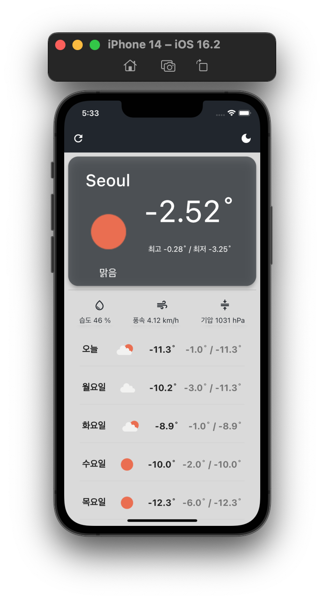
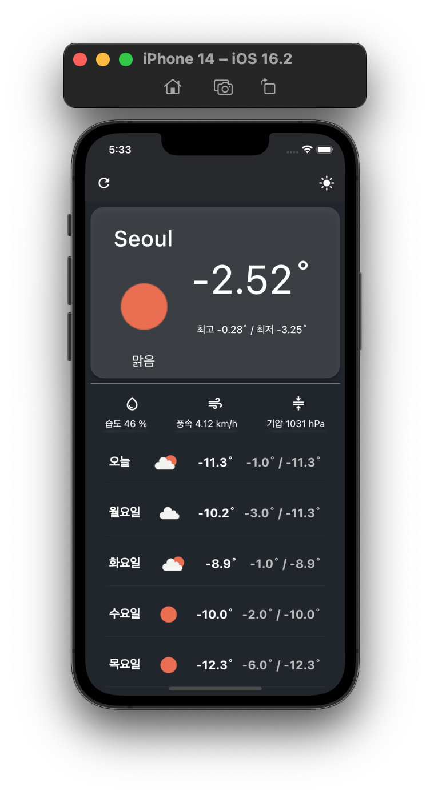

# Tenki
> GDSC-Mobile 날씨 애플리케이션 과제의 내용이 포함되어 있습니다.

## Features
<p align="center">


</p>

## Requirements
**`certification.dart`**
```dart    
class Certification {
  static const String appid = {"YOUR APP ID"};
  static const String scheme = "https://";
  static const String domain = "api.openweathermap.org";
  static const String path = "data/2.5/weather";
}
```